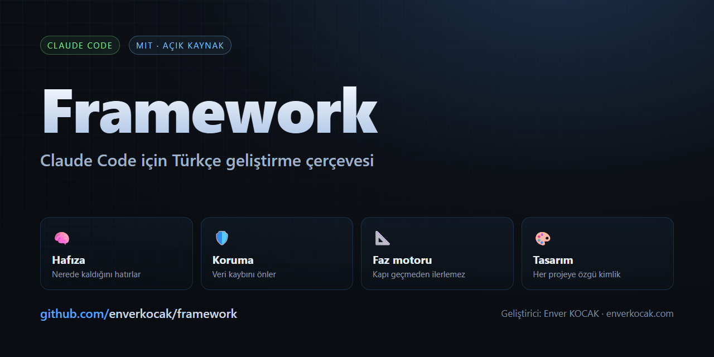

# . - içindekiler

> Bu belge otomatik üretilir. Elle satır eklenmez;
> açıklamalar dosyaların kendisinden okunur.

## Klasörler

| Klasör | Ne için |
|--------|---------|
| `plugins/` | Çerçevenin kendisi - komutlar, ajanlar, beceriler, kancalar, betikler |
| `sablonlar/` | Yeni proje ve faz planı şablonları |

## Dosyalar

| Dosya | Ne işe yarar |
|-------|--------------|
| `CLAUDE.md` | 1. **Kod yorum satırlarında** üretim aracı adı geçmez. Yorum, kodu |
| `CONTRIBUTING.md` | Türkçe aşağıda · English below. |
| `DEGISIKLIKLER.md` | Enver Framework'ün sürüm geçmişi. |
| `guncelle.ps1` | Enver Framework - Guncelleme (Windows) |
| `guncelle.sh` | Enver Framework - Güncelleme |
| `KULLANIM-KILAVUZU.md` | Enver Framework'ün günlük kullanımı. Ne zaman hangi komutu çalıştıracağını, |
| `KURULUM-KILAVUZU.md` | Bu framework'ü sıfırdan kurmak için. Hiçbir adım varsayılmaz. |
| `kurulum.ps1` | Enver Framework - Kurulum (Windows) |
| `kurulum.sh` | Enver Framework - Otomatik Kurulum |
| `LICENSE` | - |
| `README.en.md` |  |
| `README.md` |  |
| `SECURITY.md` | Bir güvenlik açığı bulduysan **herkese açık konu (issue) açma.** Doğrudan yaz: |

---

Açıklaması eksik olan bir dosya varsa iki yol var:
dosyanın başına açıklama yaz, ya da bu klasöre `aciklamalar.json` koy.
