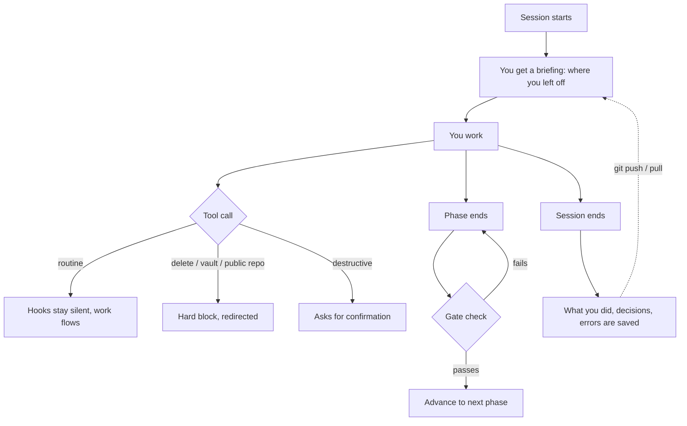

[Türkçe](README.md) · **English**

# Framework — a Turkish-first toolkit for Claude Code

[](https://github.com/enverkocak/framework/actions/workflows/test.yml)
[](LICENSE)


A project-management framework for [Claude Code](https://claude.com/claude-code):
commands, skills, agents and safety **hooks** that remember where you left off,
prevent data loss, run your project in ordered phases, and give every project a
unique design identity. Free and open source (MIT).

The interface and docs are Turkish-first, but the framework ships an English
language layer and this English guide, so anyone can install and use it.

---

## Why it exists

Three problems repeat on long projects. This framework answers each one with a
**running safeguard**, not a document you forget:

| Problem | The framework's answer |
|---------|------------------------|
| Context is lost when a session ends | Persistent memory, decision log, error library |
| A wrong command deletes data | Deletions are blocked; destructive commands ask first |
| Work stalls, order gets confused | Phase engine — you can't advance until the gate passes |

Because the rules live as **hooks that run before each tool call**, they can't be
forgotten. They are enforced, not suggested.

---

## Install

```bash
git clone https://github.com/enverkocak/framework ~/framework
cd ~/framework
chmod +x kurulum.sh
./kurulum.sh
```

On Windows use `kurulum.ps1`. Full walkthrough:
[KURULUM-KILAVUZU.md](KURULUM-KILAVUZU.md) (installation guide, Turkish).

After install, inside Claude Code:

```
/plugin marketplace add ~/.claude/plugins
/plugin install enver-framework@enver-local
/reload-plugins
/panel
```

**Requirements:** Python 3.9+, Git, and `cryptography` (`pip install cryptography`)
for the encrypted vault.

---

## How it works



Memory is committed to git, so on another machine a `git pull` brings you back to
exactly where you stopped.

---

## What's inside

**29 commands** · **3 skills** · **4 agents** · **10 protections** · **48 scripts**

### Frequently used

| Command | What it does |
|---------|--------------|
| `/panel` | Dashboard — project status, phase, pending work |
| `/durum-kaydet` | Save where you left off, create a handoff note |
| `/proje-baslat` | Start a new project from a template |
| `/faz-kontrol` | Run the active phase's gate checks |
| `/guvenlik-tara` | Security scan |
| `/saglik` | The framework's own health report |
| `/guncelle` | Update to the newest version in one command |

Full list: `/index` in a session, or [KULLANIM-KILAVUZU.md](KULLANIM-KILAVUZU.md)
(usage guide).

### Protections (hooks)

Hooks run through `.claude/settings.json` and intervene **before** a command runs.

| Protection | What it does |
|------------|--------------|
| `veri-koruma.py` | Blocks deletions; asks before destructive commands |
| `kasa-koruma.py` | Blocks direct vault access and secrets written into code |
| `sunucu-koruma.py` | Blocks stepping outside allowed directories on a server |
| `git-gizlilik-koruma.py` | Blocks making a repo public by accident |
| `yazim-kontrol.py` | Enforces Turkish spelling and character rules |
| `kalite-kapisi.py` | Blocks saying "done" before the gate passes |

All ten and how to relax them are covered in the usage guide.

---

## Key ideas

- **Memory that survives sessions** — a decision log and error library mean you
  never re-explain context or re-solve the same bug.
- **Data is never deleted** — everything is archived with a note instead.
- **Phases with gates** — "done" is a measurement (the gate's failing count is
  zero), not an opinion.
- **Unique design per project** — no two projects look alike.
- **Full-authority mode** — when you turn it on, the "Do you want to proceed?"
  prompt never appears; work runs end to end. Hard blocks (delete, vault, public
  repo, off-map server) still stand.
- **Multi-machine** — memory is in git; `git pull` on another computer resumes
  your work.

---

## Customize

The framework defaults to Turkish and reads identity from settings. What to
change for yourself:

| File | For |
|------|-----|
| `~/.claude/enver/ayarlar.json` | Your name, site, email — written into generated files |
| `CLAUDE.md` | Your working rules (an example ships in the box) |
| `plugins/enver-framework/references/sunucu-haritasi.json` | Servers and allowed directories |

These ship as `.ornek` (example) templates; no personal data appears until you
fill in your own.

---

## Test

```bash
bash plugins/enver-framework/scripts/testler/tumunu-calistir.sh
```

Phase gates, protection scenarios, spelling checks and the health report run in a
single command.

---

## Contributing

Bug reports and ideas are welcome — open an issue on the repository. See
[CONTRIBUTING.md](CONTRIBUTING.md).

## License

MIT — see [LICENSE](LICENSE). Copyright © 2026 Enver KOCAK ·
[enverkocak.com](https://enverkocak.com)
