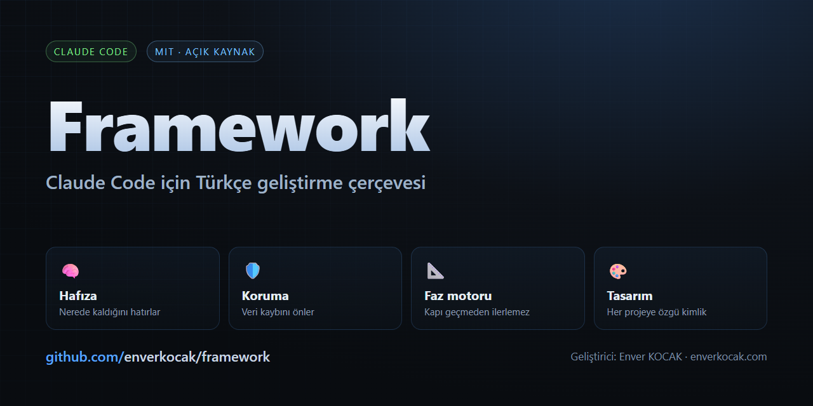
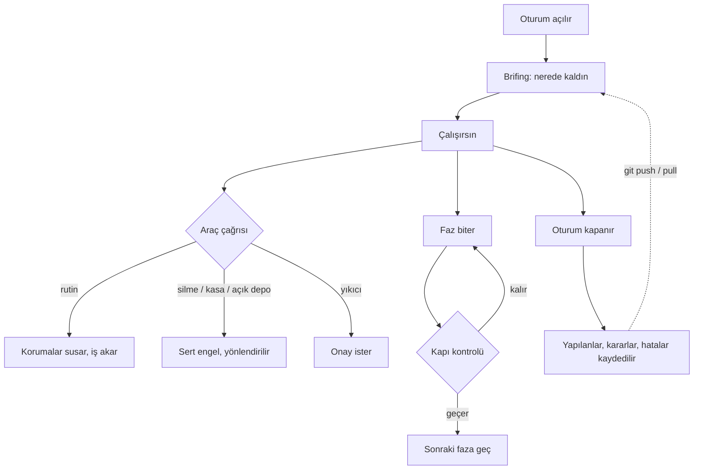

**Türkçe** · [English](README.en.md)

# Framework — Claude Code için Türkçe geliştirme çerçevesi

[](https://github.com/enverkocak/framework/actions/workflows/test.yml)
[](LICENSE)


[Claude Code](https://claude.com/claude-code) için proje yönetim çerçevesi:
komutlar, beceriler, ajanlar ve **koruma kancaları**. Ücretsiz ve açık kaynak.

Bir projede nerede kaldığını hatırlar, veri kaybını önler, fazları sırayla
yürütür ve her projeye kendine özgü bir tasarım kimliği üretir.

**Geliştirici:** Enver KOCAK · [enverkocak.com](https://enverkocak.com) · mail@enverkocak.com
**Lisans:** MIT — serbestçe kullanabilir, değiştirebilir, dağıtabilirsin.

---

## Neden var

Uzun projelerde tekrar eden üç sorun vardır:

| Sorun | Çerçevenin cevabı |
|-------|-------------------|
| Oturum kapanınca bağlam kaybolur | Kalıcı hafıza, karar defteri, hata kütüphanesi |
| Yanlış bir komut veriyi siler | Silme komutları engellenir, yıkıcı olanlar onay ister |
| İş yarım kalır, sıra karışır | Faz motoru — kapı kontrolü geçmeden sonraki faza geçilmez |

Kurallar belge olarak değil, **çalışan koruma** olarak durur. Yani unutulmaz.

---

## Kurulum

**En hızlısı** — Claude Code içinde tek satır:

```
/plugin marketplace add enverkocak/framework
/plugin install enver-framework@enver-framework
/reload-plugins
/panel
```

Komutlar, beceriler, ajanlar ve **korumalar** bununla gelir.

**Tam kurulum** (kimlik, kasa, çoklu bilgisayar hafızası) için ayrıca:

```bash
git clone https://github.com/enverkocak/framework ~/framework
cd ~/framework && ./kurulum.sh    # Windows: kurulum.ps1
```

Ayrıntı için [KURULUM-KILAVUZU.md](KURULUM-KILAVUZU.md).

---

## Kılavuzlar

| Belge | Kim için |
|-------|----------|
| [KURULUM-KILAVUZU.md](KURULUM-KILAVUZU.md) | Sıfırdan kuracak olan |
| [KULLANIM-KILAVUZU.md](KULLANIM-KILAVUZU.md) | Günlük kullanım |
| [DEGISIKLIKLER.md](DEGISIKLIKLER.md) | Sürüm geçmişi — ne değişti ve neden |

---

## İçinde ne var

**29 komut** · **3 beceri** · **4 ajan** · **10 koruma** · **48 betik**

### Sık kullanılanlar

| Komut | Ne yapar |
|-------|----------|
| `/panel` | Kontrol paneli — proje durumu, faz, bekleyen işler |
| `/durum-kaydet` | Nerede kaldığını kaydet, devir notu oluştur |
| `/proje-baslat` | Yeni projeyi şablonla başlat |
| `/faz-kontrol` | Aktif fazın kapı kontrollerini çalıştır |
| `/guvenlik-tara` | Güvenlik taraması |
| `/saglik` | Çerçevenin kendi sağlık raporu |
| `/guncelle` | Yeni sürüme tek komutla geç |

Tam liste: [KULLANIM-KILAVUZU.md](KULLANIM-KILAVUZU.md)

### Korumalar

Kancalar `.claude/settings.json` üzerinden devrededir ve komut çalışmadan
**önce** araya girer.

| Koruma | Ne yapar |
|--------|----------|
| `veri-koruma.py` | Silme komutlarını engeller, yıkıcı olanlarda onay ister |
| `kasa-koruma.py` | Kasaya doğrudan erişimi ve koda sır yazılmasını engeller |
| `sunucu-koruma.py` | Sunucuda izinli dizin dışına çıkmayı engeller |
| `git-gizlilik-koruma.py` | Depoyu istemeden herkese açık yapmayı engeller |
| `yazim-kontrol.py` | Türkçe yazım ve karakter kuralını denetler |
| `kalite-kapisi.py` | Kapı kontrolü geçmeden "bitti" denmesini engeller |

Onunun tamamı ve nasıl gevşetileceği kılavuzda anlatılır.

---

## Nasıl çalışır



Hafıza depoya girdiği için başka bir bilgisayarda `git pull` yaptığında
kaldığın yerden devam edersin.

---

## Uyarlama

Çerçeve varsayılan olarak Türkçe çalışır ve kimlik bilgisi ayardan okunur.
Kendine göre değiştirmen gereken yerler:

| Dosya | Ne için |
|-------|---------|
| `~/.claude/enver/ayarlar.json` | Adın, siten, e-postan — üretilen dosyalara bu yazılır |
| `CLAUDE.md` | Kendi çalışma kuralların (örnek sürüm kutudan çıkar) |
| `plugins/enver-framework/references/sunucu-haritasi.json` | Sunucu ve izinli dizinler |

Tek bir projede farklı bilgi kullanmak istersen o projenin içine
`.claude/enver-ayarlar.json` koy; kullanıcı katmanına üstün gelir.

Bu dosyalar örnek sürümleriyle gelir; kendi bilgin yazılana kadar hiçbir
yerde kişisel veri bulunmaz.

---

## Test

```bash
bash plugins/enver-framework/scripts/testler/tumunu-calistir.sh
```

Faz kapıları, koruma senaryoları, yazım denetimi ve sağlık kontrolü tek
komutta çalışır.

---

## Katkı

Hata bildirimi ve öneri için depo üzerinden konu (issue) açabilirsin.

## Lisans

MIT — ayrıntı için [LICENSE](LICENSE).
