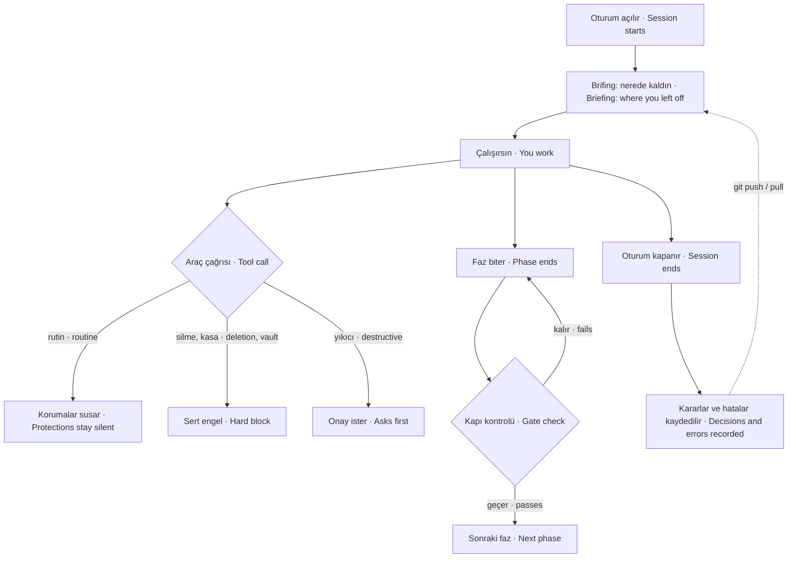

**Türkçe** · [English](README.en.md)

# Framework — Claude Code için Türkçe geliştirme çerçevesi
### *A Turkish-first project framework for Claude Code*

[](https://github.com/enverkocak/framework/actions/workflows/test.yml)
[](LICENSE)


> **🇬🇧 English speaker?** Every section below is written in both
> languages: Turkish first, English in italics underneath. Full English
> documentation:
> **[README](README.en.md)** ·
> [Installation](KURULUM-KILAVUZU.en.md) ·
> [User guide](KULLANIM-KILAVUZU.en.md) ·
> [Changelog](DEGISIKLIKLER.en.md)

[Claude Code](https://claude.com/claude-code) için proje yönetim çerçevesi:
komutlar, beceriler, ajanlar ve **koruma kancaları**. Ücretsiz ve açık kaynak.

Bir projede nerede kaldığını hatırlar, veri kaybını önler, fazları sırayla
yürütür ve her projeye kendine özgü bir tasarım kimliği üretir.

> *A project-management framework for [Claude Code](https://claude.com/claude-code):
> commands, skills, agents and **protection hooks**. Free and open source.
> It remembers where you left off, prevents data loss, runs phases in
> order, and gives every project its own visual identity.*

**Geliştirici · Developer:** Enver KOCAK · [enverkocak.com](https://enverkocak.com) · mail@enverkocak.com
**Lisans · License:** MIT — serbestçe kullanabilir, değiştirebilir, dağıtabilirsin.
*Use, modify and distribute it freely.*

---

## Neden var · Why it exists

Uzun projelerde tekrar eden üç sorun vardır:

*Three problems repeat in long-running projects:*

| Sorun · Problem | Çerçevenin cevabı · The framework's answer |
|-----------------|--------------------------------------------|
| Oturum kapanınca bağlam kaybolur<br>*Context is lost when the session ends* | Kalıcı hafıza, karar defteri, hata kütüphanesi<br>*Persistent memory, decision ledger, error library* |
| Yanlış bir komut veriyi siler<br>*A wrong command deletes data* | Silme komutları engellenir, yıkıcı olanlar onay ister<br>*Deletions are blocked; destructive commands ask first* |
| İş yarım kalır, sıra karışır<br>*Work is left half-done and the order slips* | Faz motoru — kapı kontrolü geçmeden sonraki faza geçilmez<br>*A phase engine: no next phase until the gate check passes* |

Kurallar belge olarak değil, **çalışan koruma** olarak durur. Yani unutulmaz.

> *The rules do not live in a document; they live as **running
> protections**. That is why they are never forgotten.*

---

## Kurulum · Install

**En hızlısı** — Claude Code içinde tek satır:

*The fastest way — inside Claude Code:*

```
/plugin marketplace add enverkocak/framework
/plugin install enver-framework@enver-framework
/reload-plugins
/panel
```

Komutlar, beceriler, ajanlar ve **korumalar** bununla gelir.

> *Commands, skills, agents and **protections** all arrive with this.*
> *If a short command name does not resolve on your machine, use the
> namespaced form: `/enver-framework:panel`.*

**Tam kurulum** (kimlik, kasa, çoklu bilgisayar hafızası) için ayrıca:

*For the **full setup** (identity, vault, multi-computer memory):*

```bash
git clone https://github.com/enverkocak/framework ~/framework
cd ~/framework && ./kurulum.sh    # Windows: kurulum.ps1
```

Ayrıntı için [KURULUM-KILAVUZU.md](KURULUM-KILAVUZU.md).
*Details: [Installation guide](KURULUM-KILAVUZU.en.md).*

> *Requirements: Python 3.9+, Git, and Bash for the test suite. On macOS
> and some Linux setups the command is `python3`, not `python`.*

---

## Kılavuzlar · Guides

| Türkçe | English | Kim için · For whom |
|--------|---------|---------------------|
| [KURULUM-KILAVUZU.md](KURULUM-KILAVUZU.md) | [Installation](KURULUM-KILAVUZU.en.md) | Sıfırdan kuracak olan · setting up from scratch |
| [KULLANIM-KILAVUZU.md](KULLANIM-KILAVUZU.md) | [User guide](KULLANIM-KILAVUZU.en.md) | Günlük kullanım · daily use |
| [DEGISIKLIKLER.md](DEGISIKLIKLER.md) | [Changelog](DEGISIKLIKLER.en.md) | Sürüm geçmişi · what changed and why |

Her belge iki dilde yazılır ve bu bir kapı kontrolüyle ölçülür; biri tek
dilli kalırsa test kalır.

> *Every document exists in both languages, and a gate check measures it:
> if one falls back to a single language, the suite fails.*

---

## İçinde ne var · What's inside

**30 komut** · **4 beceri** · **5 ajan** · **10 koruma** · **54 betik**

*30 commands · 4 skills · 5 agents · 10 protections · 53 scripts*

### Sık kullanılanlar · Frequently used

| Komut | Ne yapar | What it does |
|-------|----------|--------------|
| `/panel` | Kontrol paneli — proje durumu, faz, bekleyen işler | Dashboard: project status, phase, pending work |
| `/durum-kaydet` | Nerede kaldığını kaydet, devir notu oluştur | Save where you left off, write a handover note |
| `/proje-baslat` | Yeni projeyi şablonla başlat | Start a new project from a template |
| `/proje-devral` | Var olan projeyi tara, öğren, çerçeveye bağla | Take over an existing project: scan, learn, wire in |
| `/faz-kontrol` | Aktif fazın kapı kontrollerini çalıştır | Run the active phase's gate checks |
| `/guvenlik-tara` | Güvenlik taraması | Security scan |
| `/saglik` | Çerçevenin kendi sağlık raporu | The framework's own health report |
| `/guncelle` | Yeni sürüme tek komutla geç | Update to the newest version in one command |

Tam liste: [KULLANIM-KILAVUZU.md](KULLANIM-KILAVUZU.md) ·
*Full list: [User guide](KULLANIM-KILAVUZU.en.md), or `/index` in a session.*

### Korumalar · Protections

Kancalar eklentinin `hooks.json` dosyasıyla devreye girer ve komut
çalışmadan **önce** araya girer.

> *Hooks are activated through the plugin's `hooks.json` and step in
> **before** a command runs.*

| Koruma | Ne yapar | What it does |
|--------|----------|--------------|
| `veri-koruma.py` | Silme komutlarını engeller, yıkıcı olanlarda onay ister | Blocks deletions; asks before destructive commands |
| `kasa-koruma.py` | Kasaya doğrudan erişimi ve koda sır yazılmasını engeller | Blocks direct vault access and secrets written into code |
| `sunucu-koruma.py` | Sunucuda izinli dizin dışına çıkmayı engeller | Blocks stepping outside allowed directories on a server |
| `git-gizlilik-koruma.py` | Depoyu istemeden herkese açık yapmayı engeller | Blocks making a repository public by accident |
| `iz-kontrol.py` | Kod yorumlarında araç izi arar | Scans code comments for tool traces |
| `yazim-kontrol.py` | Türkçe yazım ve karakter kuralını denetler | Enforces Turkish spelling and character rules |
| `kalite-kapisi.py` | Kapı kontrolü geçmeden "bitti" denmesini engeller | Blocks saying "done" before the gate passes |

Onunun tamamı ve nasıl gevşetileceği kılavuzda anlatılır.
*All ten, and how to relax them, are covered in the user guide.*

---

## Nasıl çalışır · How it works


```mermaid
flowchart TD
    A[Oturum açılır · Session starts] --> B[Brifing: nerede kaldın · Briefing: where you left off]
    B --> C[Çalışırsın · You work]
    C --> D{Araç çağrısı · Tool call}
    D -->|rutin · routine| E[Korumalar susar · Protections stay silent]
    D -->|silme, kasa · deletion, vault| F[Sert engel · Hard block]
    D -->|yıkıcı · destructive| G[Onay ister · Asks first]
    C --> H[Faz biter · Phase ends]
    H --> I{Kapı kontrolü · Gate check}
    I -->|geçer · passes| J[Sonraki faz · Next phase]
    I -->|kalır · fails| H
    C --> K[Oturum kapanır · Session ends]
    K --> L[Kararlar ve hatalar kaydedilir · Decisions and errors recorded]
    L -.git push / pull.-> B
```

Hafıza depoya girdiği için başka bir bilgisayarda `git pull` yaptığında
kaldığın yerden devam edersin.

> *Memory is committed to the repository, so a `git pull` on another
> computer picks up exactly where you stopped.*

---

## Uyarlama · Customize

Çerçeve varsayılan olarak Türkçe çalışır ve kimlik bilgisi ayardan okunur.
Kendine göre değiştirmen gereken yerler:

> *The framework runs in Turkish by default and reads identity details
> from settings. What you need to change for yourself:*

| Dosya · File | Ne için · What for |
|--------------|--------------------|
| `~/.claude/enver/ayarlar.json` | Adın, siten, e-postan — üretilen dosyalara bu yazılır<br>*Your name, site and e-mail — written into generated files* |
| `CLAUDE.md` | Kendi çalışma kuralların<br>*Your own working rules (an example ships with it)* |
| `plugins/enver-framework/references/sunucu-haritasi.json` | Sunucu ve izinli dizinler<br>*Servers and permitted directories* |
| `plugins/enver-framework/diller/en.json` | Arayüz dilini İngilizceye çevirmek için<br>*Switch the interface language to English* |

Tek bir projede farklı bilgi kullanmak istersen o projenin içine
`.claude/enver-ayarlar.json` koy; kullanıcı katmanına üstün gelir.

Bu dosyalar örnek sürümleriyle gelir; kendi bilgin yazılana kadar hiçbir
yerde kişisel veri bulunmaz.

> *For per-project overrides, drop `.claude/enver-ayarlar.json` into that
> project; it wins over the user-level settings. Everything ships as an
> example file, so no personal data exists anywhere until you write your
> own.*

---

## Test · Test

```bash
bash plugins/enver-framework/scripts/testler/tumunu-calistir.sh
```

Faz kapıları, koruma senaryoları, yazım denetimi ve sağlık kontrolü tek
komutta çalışır. Yaklaşık 40 saniye; hepsi geçmelidir.

> *Phase gates, protection scenarios, spelling checks and the health
> report run in one command — about 40 seconds, and everything must pass.
> CI runs the same suite on Windows and macOS.*

---

## Katkı · Contributing

Hata bildirimi ve öneri için depo üzerinden konu (issue) açabilirsin.
Türkçe ya da İngilizce yazabilirsin.

> *Open an issue for bugs or suggestions — in Turkish or English.*

## Lisans · License

MIT — ayrıntı için [LICENSE](LICENSE).
*MIT — see [LICENSE](LICENSE) for details.*
